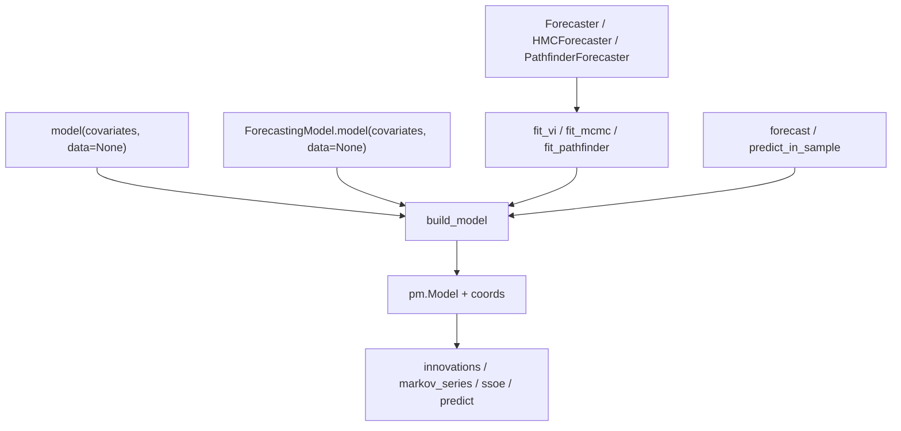

# Functional core for numpyro-forecast 0.3 / 0.4 catch-up

Issue: https://github.com/pymc-labs/pymc-forecast/issues/57

Status: approved and in progress on `feat/functional-core`. Paused after
Task 2's commit, before its review returned. Resume from
[2026-10-01-functional-core-RESUME.md](2026-10-01-functional-core-RESUME.md).
One PR after Task 8. No release in that PR.

Upstream studied: `numpyro_forecast` 0.4.0 (`Horizon.from_data`,
`innovations`, `markov_series`, `ssoe`, `predict`). `time_reparam` was
studied and left out; findings are in
[#58](https://github.com/pymc-labs/pymc-forecast/issues/58). This package
stays a PyMC design: named dims, `InferenceData`, no axis-`-2` layout, no
equinox, no plates.

## Approval gate

Reject any row and the corresponding task changes. Everything else is fixed.

| # | Decision | Why |
|---|---|---|
| 1 | Model bodies become `(covariates, data=None) -> None`. First line of a function body is `h = Horizon.from_data(covariates, data)`. `build_model` still owns the `pm.Model` and the coords. | This is the 0.4 functional entry. `Horizon` is no longer an argument the driver injects. |
| 2 | Clean cutover. Delete `time_series`, `markov_time_series`, and `Horizon.from_arrays`. No aliases, no deprecation shims. | Pre-alpha 0.2.0. Callers are this repo's tests, docs, and the nine current notebooks. |
| 3 | `innovations` takes a `.dist()` or a pymc-extras `Prior`, not an `RVFactory`. Non-centered noise is `innovations(...) * scale` outside the call. | Matches 0.4 and removes the `(name, dims) -> RV` factory from the core path. |
| 4 | `predict` keeps the 4-argument observation factory. New primary form is a 1-argument callable `segment_latent -> .dist()`. A zero-centered `.dist()` is accepted only for `Normal` and `StudentT`. | Intermittent demand and retail need segment-aware likelihoods. A general loc-surgery module is out (PLAN.md already dropped `surgery.py`). |
| 5 | `ssoe` argument order matches upstream, but `y=None` still means `h.data`, and `params=` stays. `SSOEResult` stays a frozen dataclass with `dims`. | PyTensor `scan` cannot close over RVs. Named coords still need `dims`. |
| 6 | Rename `markov_time_series` to `markov_series`. Do not add `advance=`. | `advance` exists upstream for a latent-VAR lag window. That composition belongs to the later Impulso integration, not this PR. |
| 7 | No `time_reparam`. No Haar, no DCT, no `reparam.py`. | The PyMC port is a transform-registration problem, not a rename. [#58](https://github.com/pymc-labs/pymc-forecast/issues/58) records the findings. No current example calls it. |
| 8 | Functional fitters `fit_vi` / `fit_mcmc` / `fit_pathfinder` are the core. `Forecaster`, `HMCForecaster`, `PathfinderForecaster` stay, with the same constructors and attributes, and call those functions. | OOP remains the Pyro-shaped entry. Inference behavior does not move. |
| 9 | No VAR surface. No `var.py`, no `var_mean` / `var_step` / `companion_matrix` / `impulse_response`, no Minnesota prior, no VAR notebook. | [Impulso](https://github.com/QuantClimate/Impulso) already owns Bayesian VAR / SVAR, identification, and impulse responses. A later issue integrates it. This PR does not stub that integration. |
| 10 | Version stays `0.2.0`. Breaking notes go under `CHANGELOG.md` `Unreleased`. Recommend `0.3.0` at release time. | This PR does not publish. |

## Goal

One model definition trains and forecasts. A function is the core. A
`ForecastingModel` subclass is a thin wrapper around the same primitives.
The nine notebooks already in `docs/examples/` run on the new signatures.
Prediction schema names do not change.

## Non-goals

- New notebooks, including anything upstream added after the notebooks we
  already have (VAR, TSB, Croston, censored-demand, availability, a second
  hierarchical notebook, electricity calibration, dynestyx).
- Haar / DCT `time_reparam`. Deferred to
  [#58](https://github.com/pymc-labs/pymc-forecast/issues/58).
- `acf` / `pacf`. No current example calls them.
- `backtest_vectorized`, `pm.Data` window reuse, or a new `backtest` argument.
  `backtest` keeps `forecaster_cls`.
- Impulso integration, embeddable VAR, impulse responses, FEVD.
- `markov_series(..., advance=)`, `plates=`, `reparam=`, or pytree `xs`.
- Changing `StatespaceModel`. Its methods stay `(data, covariates)` because
  that is the pymc-extras contract. It is the OOP-only exception.
- Axis-`-2` compatibility, equinox `Horizon`, JAX pytrees.
- A version bump or a GitHub release.

## Architecture



`build_model` normalizes arrays, builds `Horizon.from_data` once to register
`"time"` / `"time_future"` coords, then calls the model. The model calls
`Horizon.from_data` again. Both calls are pure and must agree. Forecasting
replay is unchanged: in-sample latents are trace variables, `{name}_future`
is absent from the trace, `pm.sample_posterior_predictive` draws the future
from the prior.


## Target API

### Model function

```python
def local_level(covariates, data=None):
    h = Horizon.from_data(covariates, data)
    sigma = pm.HalfNormal("sigma", 1.0)
    drift = innovations(h, "drift", pm.Normal.dist(0.0, 0.5))
    predict(h, lambda mu: pm.Normal.dist(mu, sigma), pt.cumsum(drift, axis=0))
```

`covariates` is always a `DataArray` when the driver calls the function.
Covariate-free models receive the existing zero-width covariates from
`null_covariates`. `data is None` means a prior-only build: the whole
covariate span counts as observed time, which is today's `from_arrays`
behavior.

`ModelFunction` becomes `Callable[[xr.DataArray, xr.DataArray | None], None]`.

### Horizon

```python
@classmethod
def from_data(cls, covariates: xr.DataArray, data: xr.DataArray | None) -> Horizon: ...
```

Same body as today's `from_arrays`. Delete `from_arrays`. Keep `t_obs`,
`future`, `duration`. Do not add `zero_data`.

### innovations

```python
def innovations(
    h: Horizon,
    name: str,
    dist,
    *,
    dims: tuple[str, ...] = (),
) -> pt.TensorVariable: ...
```

`dist` is either a pymc-extras `Prior` or an unnamed `.dist()` tensor
(`pm.Normal.dist(0.0, sigma)`). A `Prior` follows today's
`prior_rv_factory` path, including one shared draw of nested hyperpriors.
A `.dist()` is expanded to the segment shape and registered:

- in-sample: `register_rv(..., name, dims=("time", *dims))`
- forecast, only when `h.future > 0`: `register_rv(..., f"{name}_future", dims=("time_future", *dims))`

Return `pt.concatenate([prefix, suffix], axis=0)`. Empty forecast suffix has
length 0 on axis 0, as today.

Expansion lives in private `pymc_forecast/_dist.py`:

```python
def expand_dist(dist: pt.TensorVariable, shape) -> pt.TensorVariable:
    """Resize an unnamed `.dist()` tensor. Not public."""
    from pymc.distributions.distribution import _change_dist_size

    return _change_dist_size(dist.owner.op, dist, shape, expand=True)
```

`_change_dist_size` is private. Depend on it deliberately. A regression test
must fail if PyMC removes it. Do not copy the singledispatch. Shape comes
from `model.dim_lengths` for `("time", *dims)` or `("time_future", *dims)`.
Scalar parameters broadcast. A dist that already carries a time dimension
raises `HorizonError` — the helper owns the time axis.


### predict

```python
def predict(
    h: Horizon,
    obs,
    latent: pt.TensorVariable,
    *,
    expected_observation: pt.TensorVariable | None = None,
    dims: tuple[str, ...] | None = None,
) -> None: ...
```

Dispatch `obs` in this order:

1. Prior-like (`is_prior_like`): today's `prior_obs_factory` path. Still
   requires `mu` left unset.
2. Callable whose signature has a parameter named `observed`: today's
   4-argument factory `(name, latent, dims, observed) -> RV`. This is the
   supported form for segment-aware likelihoods (time-varying scale,
   hurdle models). Not legacy.
3. Any other callable: call it once per segment as `obs(segment_latent)`.
   It must return an unnamed `.dist()`. Register that dist with
   `observed=` on the in-sample segment and without `observed` on the
   forecast segment. Dims are `("time", *dims)` and `("time_future", *dims)`.
4. A `TensorVariable` produced by `pm.Normal.dist` or `pm.StudentT.dist`,
   whose location input is a constant 0. Rebuild through the public
   constructor with that location replaced by the segment latent:

   | op | zero input index | scale input index | rebuild |
   |---|---|---|---|
   | `NormalRV` | 2 | 3 | `pm.Normal.dist(mu, sigma)` |
   | `StudentTRV` | 3 (`mu`) | 4 (`sigma`) | `pm.StudentT.dist(nu, mu, sigma=sigma)` with `nu` at input 2 |

   Any other dist, or a non-zero location, raises `HorizonError` naming the
   1-argument callable. Do not add a family registry beyond these two.

`"mu"` / `"mu_future"` and optional `expected_observation` /
`expected_observation_future` stay exactly as they are. Reserved names stay
reserved.

### markov_series

```python
def markov_series(
    h: Horizon,
    name: str,
    init,
    transition,
    *,
    params: Sequence = (),
    xs=None,
    dims: tuple[str, ...] = (),
) -> pt.TensorVariable: ...
```

Same scan behavior as `markov_time_series`. `params=` stays. `xs` stays one
`DataArray`. No `advance`. Delete the old name.

### ssoe

```python
def ssoe(
    h: Horizon,
    name: str,
    y,
    init,
    mean,
    update,
    noise,
    xs=None,
    *,
    params: Sequence = (),
    dims: tuple[str, ...] | None = None,
) -> SSOEResult: ...
```

`y=None` uses `h.data`. `noise` is a `.dist()` or a `Prior`, expanded and
registered as `{name}_future` only. In-sample errors remain residuals
`y - mu`, not random variables. `mean(state, x, *params)` and
`update(state, y, error, x, *params)` keep `params` because scan cannot
close over RVs. Document that difference next to the signature. Do not
auto-detect closed-over RVs.

`SSOEResult` fields stay `mu`, `mu_future`, `y_future`, `dims`.

### ForecastingModel

```python
class ForecastingModel(PriorConfig, abc.ABC):
    def __call__(self, covariates, data=None) -> None:
        self._horizon = Horizon.from_data(covariates, data)
        try:
            self.model(covariates, data)
        finally:
            self._horizon = None

    @abc.abstractmethod
    def model(self, covariates, data=None) -> None: ...

    @property
    def horizon(self) -> Horizon: ...

    def innovations(self, name, dist, *, dims=()): ...
    def predict(self, obs, latent, *, expected_observation=None, dims=None): ...
    def markov_series(self, name, init, transition, *, params=(), xs=None, dims=()): ...
```

No bound `ssoe`. Class bodies that need it call `ssoe(self.horizon, ...)`.
`build_model` calls `model_fn(covariates, data)` for both functions and
instances. Instances are callable, so the `isinstance` branch only has to
keep working; it must not pass `h` in.

### Fitters

New `pymc_forecast/fit.py`:

```python
@dataclass(frozen=True)
class FitResult:
    idata: az.InferenceData | None
    approx: pm.Approximation | None
    losses: np.ndarray | None
    method: str


def fit_vi(
    model_fn,
    data=None,
    covariates=None,
    *,
    method="advi",
    optimizer=None,
    backend=None,
    num_steps=10_000,
    random_seed=None,
    progressbar=None,
    fit_kwargs=None,
) -> FitResult: ...


def fit_mcmc(
    model_fn,
    data=None,
    covariates=None,
    *,
    draws=1000,
    tune=1000,
    chains=2,
    nuts_sampler="pymc",
    random_seed=None,
    progressbar=None,
    sample_kwargs=None,
) -> FitResult: ...


def fit_pathfinder(
    model_fn,
    data=None,
    covariates=None,
    *,
    random_seed=None,
    progressbar=None,
    pathfinder_kwargs=None,
) -> FitResult: ...


def draw_posterior(
    result: FitResult, num_samples: int, random_seed=None, *, batch_size: int | None = None
) -> xr.Dataset: ...
```

Each fitter takes an optional already-built `model=`. When `model` is
omitted, it calls `build_model(model_fn, data, covariates)` once and
samples that model. Class `_fit` methods pass `model=self.model` and
do not build again. `StatespaceForecaster` overrides `_build_model`
and inherits `HMCForecaster._fit`, so `model=self.model` is what keeps
the Kalman graph. Do not call `build_model` from a statespace fit.

Do not change constructor keyword arguments, defaults, error types, or
attributes (`approx`, `losses`, `idata`, `is_fitted`). VI results have
`approx` and `losses` and `idata is None` until something draws. MCMC
and Pathfinder set `idata`. `draw_posterior` on a VI result samples the
approx, including the existing `batch_size` chunking. On MCMC /
Pathfinder it thins `idata.posterior`.

`forecast` / `predict_in_sample` signatures do not change. They already
take a posterior dataset. In `forecaster.py`, import the function as
`draw_posterior_result` so the method of the same name does not shadow
it.


## Public exports

Add to `pymc_forecast/__init__.py` and `__all__`: `innovations`,
`markov_series`, `fit_vi`, `fit_mcmc`, `fit_pathfinder`,
`FitResult`, `draw_posterior`.

Remove: `time_series`, `markov_time_series`.

`draw_posterior` is the new function. The forecaster method of the same
name stays. Its body calls `draw_posterior_result` on the stored
`FitResult`. Do not export a second public name.

## Breaking changes to record

- Model signature `(h, covariates)` to `(covariates, data=None)`.
- `ForecastingModel.model(self, h, covariates)` to
  `model(self, covariates, data=None)`.
- `time_series` removed. Use `innovations`.
- `markov_time_series` removed. Use `markov_series`.
- `Horizon.from_arrays` removed. Use `Horizon.from_data`.
- `ssoe(h, name, init, mean, update, noise_fn, *, y=..., params=...)`
  becomes `ssoe(h, name, y, init, mean, update, noise, xs=None, *, params=..., dims=...)`.
- `predict`'s second argument is no longer only a 4-argument factory.

Prediction variable names are not a breaking change.

## Files

| File | Action |
|---|---|
| `pymc_forecast/model.py` | Signature, `from_data`, `innovations`, `predict` dispatch, facade |
| `pymc_forecast/_dist.py` | New. Private dist expansion |
| `pymc_forecast/markov.py` | Rename to `markov_series` |
| `pymc_forecast/ssoe.py` | Argument order, dist noise |
| `pymc_forecast/fit.py` | New. Fitters and `FitResult` |
| `pymc_forecast/forecaster.py` | Delegate `_fit` / posterior draw |
| `pymc_forecast/__init__.py` | Exports |
| `tests/test_model.py`, `test_markov.py`, `test_ssoe.py`, `test_priors.py`, `test_forecaster.py`, `test_prediction.py`, `test_alignment.py`, `test_replay_mechanism.py`, `example_models.py` | Update to the new signatures in the task that breaks them |
| `tests/test_fit.py` | New |
| `docs/examples/*.ipynb` | Migrate. Do not add notebooks |
| `README.md`, `docs/quickstart.md`, `docs/api/*.md`, `CHANGELOG.md`, `PLAN.md` | Document the cutover |

Do not create `pymc_forecast/var.py`, `tests/test_var.py`, `docs/api/var.md`,
or an impulse-response helper.

## Tasks

Each task ends with `uv run pytest -q` green. Notebooks are not part of
pytest, so they stay red until Task 6. Do not open the PR until Task 8
passes. "No aliases" means no compatibility wrapper around a deleted
name. A name scheduled for a later task still exists until that task.

### Task 1: Model signature and Horizon.from_data

Files: `pymc_forecast/model.py`, every test that defines `def model(h, covariates)`
or `def model(self, h, covariates)`.

Failing test, in `tests/test_model.py`:

```python
def test_model_function_receives_covariates_then_data():
    seen = {}

    def model(covariates, data=None):
        h = Horizon.from_data(covariates, data)
        seen["t"] = h.t_obs
        seen["future"] = h.future

    data = xr.DataArray([1.0, 2.0], dims="time", coords={"time": [0, 1]})
    cov = xr.DataArray([0.0, 0.0, 0.0], dims="time", coords={"time": [0, 1, 2]})
    build_model(model, data, cov)
    assert seen == {"t": 2, "future": 1}
```

Also assert `Horizon.from_arrays` is absent, and that a `ForecastingModel`
subclass implements `model(self, covariates, data=None)` and reads
`self.horizon`.

Implementation: rename `from_arrays` to `from_data`. Change
`build_model` so it registers coords from its own `Horizon.from_data`
call, then calls `model_fn(cov_da, data_da)`. Update `ForecastingModel`
as in the target API, but leave `time_series` / `predict` bodies in
place for this task so the rename is a separate green commit. Bound
helpers still call `time_series` until Task 2.

Update every test model to take `(covariates, data=None)` and construct
`h` itself. Class tests use `self.horizon`. Do not edit notebooks yet.

Check: `uv run pytest -q`

### Task 2: innovations and predict dispatch

Files: `pymc_forecast/model.py`, `pymc_forecast/_dist.py`,
`pymc_forecast/priors.py` only if a call must move, `tests/test_model.py`,
`tests/test_priors.py`, `tests/example_models.py`.

Failing tests:

- `innovations(h, "drift", pm.Normal.dist(0.0, sigma))` registers `drift`
  with dims `("time",)` and, when the covariate span is longer, `drift_future`
  with dims `("time_future",)`. Concatenation axis is 0.
- Logp of that variable at a point equals logp of
  `pm.Normal("drift", 0.0, sigma, dims="time")` at the same point, same
  model coords.
- A `Prior("Normal", mu=Prior("Normal", mu=0, sigma=1), sigma=0.1)` still
  creates the hyperprior once, shared by both segments.
- `predict(h, lambda mu: pm.StudentT.dist(nu, mu, sigma), latent)` registers
  `obs` and, when forecasting, `forecast`.
- `predict(h, pm.StudentT.dist(nu, 0.0, sigma), latent)` matches the logp
  of `pm.StudentT("obs", nu, latent_prefix, sigma=sigma, observed=y)`.
- `predict(h, pm.Laplace.dist(0.0, 1.0), latent)` raises `HorizonError`.
- A 4-argument factory still receives `(name, latent, dims, observed)`.
- `time_series` is not importable from `pymc_forecast`.

Implementation: add `expand_dist`. Replace `time_series` with
`innovations`. Extend `predict` with the dispatch table. Keep the
factory path's current dim and observed behavior untouched. Update
`example_models.py` and prior tests to `innovations` and the callable
or dist form. Non-centered examples become
`innovations(h, "drift_raw", pm.Normal.dist(0.0, 1.0)) * scale`.

Check: `uv run pytest -q`

### Task 3: markov_series rename

Files: `pymc_forecast/markov.py`, `pymc_forecast/__init__.py`,
`tests/test_markov.py`, any other test importing `markov_time_series`.

Failing test: `markov_series` is exported; `markov_time_series` is not;
the existing random-walk recovery test passes under the new name.

No `advance` parameter. Do not add a test that the parameter is absent
beyond the signature of the exported function.

Check: `uv run pytest -q`

### Task 4: ssoe argument order

Files: `pymc_forecast/ssoe.py`, `tests/test_ssoe.py`.

Failing test: the Holt-Winters mixed-shape case calls

```python
ssoe(h, "eps", None, init, mean, update, pm.Normal.dist(0.0, sigma), params=(phi,))
```

and still reproduces the reference recursion. A second test passes
`y=` other than `h.data` and requires matching time coords. `noise` as
an `RVFactory` is not accepted.

Keep `params=` required for RV coefficients. The ARMA mean/update
signatures stay `(state, x, *params)` and `(state, y, error, x, *params)`.

Check: `uv run pytest -q`

### Task 5: Functional fitters

Files: `pymc_forecast/fit.py`, `pymc_forecast/forecaster.py`,
`pymc_forecast/__init__.py`, `tests/test_fit.py`, `tests/test_forecaster.py`.

Failing tests:

- `fit_vi` on the local-level function returns `FitResult` with `approx`,
  a `losses` vector of length `num_steps`, and `idata is None`.
- `draw_posterior(result, 20, random_seed=0)` has dims `chain`, `draw`.
- `fit_mcmc(..., draws=10, tune=10, chains=1)` returns `idata` whose
  posterior contains the same free RV names as `HMCForecaster` on the
  same model and seed.
- `Forecaster(..., num_steps=20, random_seed=0).losses` equals
  `fit_vi(..., num_steps=20, random_seed=0).losses` for a tiny conjugate
  model. Same seed, same backend, same step count.
- `backend="jax"` still runs only for `method="advi"` and still raises
  `MethodResolutionError` otherwise. Move that check; do not rewrite it.
- `fit_pathfinder` imports pymc-extras lazily and raises
  `OptionalDependencyError` when it is missing. Test the error with
  `monkeypatch` on the import, not by uninstalling.

`StatespaceForecaster` stays a subclass of `HMCForecaster`. It has no
`_fit` of its own. `HMCForecaster._fit` calls `fit_mcmc(..., model=self.model)`.
That is the statespace path. Add a smoke assertion that a statespace fit
still builds through `StatespaceForecaster._build_model`.

Check: `uv run pytest -q`


### Task 6: Migrate the current notebooks

Files: the nine notebooks under `docs/examples/`. No new files. Do not
change sampling settings, dataset windows, or plotted quantities except
where a renamed primitive forces a line to change.

| Notebook | Model after migration | Fit call |
|---|---|---|
| `forecasting_univariate.ipynb` | `local_level_seasonal(covariates, data=None)` is the executed model. `LocalLevelSeasonal.model(self, covariates, data=None)` remains a short twin and is not fit again. `innovations` + `StudentT` dist form. | `Forecaster(local_level_seasonal, ...)` so `.losses` still plots. |
| `hierarchical_forecasting.ipynb` | Function `hierarchical_local_level(covariates, data=None)`. Drop the class. | `Forecaster(hierarchical_local_level, ...)`. |
| `victoria_electricity.ipynb` | Function `electricity_demand(covariates, data=None)`. Drop the class. | `Forecaster(electricity_demand, ...)`. |
| `exponential_smoothing_state_space.ipynb` | Same function, new signature, new `ssoe` order, `pm.Normal.dist` noise. | `HMCForecaster` stays. |
| `scan_vs_statespace_local_level.ipynb` | `scan_local_level(covariates, data=None)` uses `markov_series`. `StatespaceLocalLevel` unchanged. | Both forecasters stay. |
| `retail_stockouts.ipynb` | Factory `fresh_retail_model(series_to_store, store_ids, covariate_names)` returns a `(covariates, data=None)` function. The class leaves the notebook. Heteroscedastic `obs_fn` stays a 4-argument factory. | `Forecaster(..., backend="jax")` stays. |
| `arma.ipynb` | New signature, new `ssoe` order. | `HMCForecaster` stays. |
| `intermittent_demand.ipynb` | New signature. Hurdle likelihood stays a 4-argument factory. | `HMCForecaster` stays. |
| `inference_methods_comparison.ipynb` | New signature, new `ssoe` order. | Replace class construction with `fit_vi`, `fit_mcmc`, and `fit_pathfinder`. One sentence that the classes wrap those functions. Do not add a DCT column. That comparison is [#58](https://github.com/pymc-labs/pymc-forecast/issues/58). |

Prose that names `time_series` or `(h, covariates)` is updated in the same
notebook. Site names (`drift_raw`, `phi`, `forecast`) stay.

Check, from the repo root, with the notebooks extra installed:

```bash
PYMC_FORECAST_SMOKE_TEST=1 uv run jupyter nbconvert --to notebook --execute \
  --output-dir /tmp/pymc-forecast-nb docs/examples/arma.ipynb
```

Then the same for `scan_vs_statespace_local_level.ipynb` and
`inference_methods_comparison.ipynb`. Those three cover ssoe, markov, and
the new fitters. The full set is the last task.

### Task 7: Docs and changelog

Files:

- `README.md` — quickstart uses `(covariates, data=None)`, `innovations`,
  `predict` callable or `StudentT.dist`, and `fit_vi` then `forecast`.
  Mention `ForecastingModel` as the OOP wrapper in one short example, not
  as the primary path.
- `docs/quickstart.md` — same cutover.
- `docs/api/model.md`, `markov.md`, `ssoe.md`, `forecaster.md` — new
  signatures. Delete `time_series` / `markov_time_series` / `from_arrays`.
- `docs/api/fit.md` — new page. No `docs/api/reparam.md`.
- `docs/api/index.md` — toctree entry for the fit page. No var page, no
  reparam page.
- `CHANGELOG.md` `Unreleased` — breaking list from above, plus the
  functional fitters. Do not mention `time_reparam`. State that prediction
  schema names did not change. Link issue 57.
- `PLAN.md` — add a short "0.3 / 0.4 catch-up" section that supersedes the
  model-signature sentence in decision 2. Leave the historical NumPyro
  inventory alone. State that VAR is deferred to an Impulso integration
  and that Haar / DCT are deferred to issue 58.

Check: `uv run ruff check pymc_forecast tests` and `uv run ruff format --check pymc_forecast tests`.

### Task 8: Full verification

```bash
uv run pytest
PYMC_FORECAST_SMOKE_TEST=1 uv run jupyter nbconvert --to notebook --execute \
  --output-dir /tmp/pymc-forecast-nb docs/examples/*.ipynb
uv run ruff check .
uv run ruff format --check .
```

Notebook execution is slow. Run it. Do not claim the PR is ready because
unit tests passed.

Confirm with a search of `pymc_forecast/`, `tests/`, `docs/examples/`,
`docs/api/`, `README.md`, and `CHANGELOG.md` that none of them contain
`time_series`, `markov_time_series`, `from_arrays`, `var_mean`,
`impulse_response`, `time_reparam`, or a `pymc_forecast/var.py`. `PLAN.md`
may link issue 58. This plan file is not part of that search.

## Example acceptance

A migrated notebook is done when:

- it executes under `PYMC_FORECAST_SMOKE_TEST=1` without a cell error;
- posterior and prediction variable names are the ones the notebook already
  plots (`forecast`, `obs`, `mu`, `drift_raw`, and so on);
- it does not define a new model, a new inference method, or a new figure.

## Self-review

- Issue 57 asks for a 0.3/0.4 catch-up with functional core and OOP as an
  alternative. Tasks 1–5 are that core. Task 6 is the example migration.
  Task 7 records it.
- VAR, impulse responses, and Impulso are non-goals, with no task and no
  file.
- No new notebooks. Haar / DCT are not in this PR. Decision 7 defers them
  to issue 58, which holds the registration findings.
- No shim task. Each rename deletes the old name in the same task.
- `StatespaceModel` is explicitly untouched.
- Prediction schema is explicitly untouched.
- Placeholder scan: no TBD, no "implement later" inside a task, no
  unspecified family dispatcher.
- `advance` is deferred on purpose, not forgotten. It returns with the
  Impulso integration if that integration needs a lag window this package
  owns.
